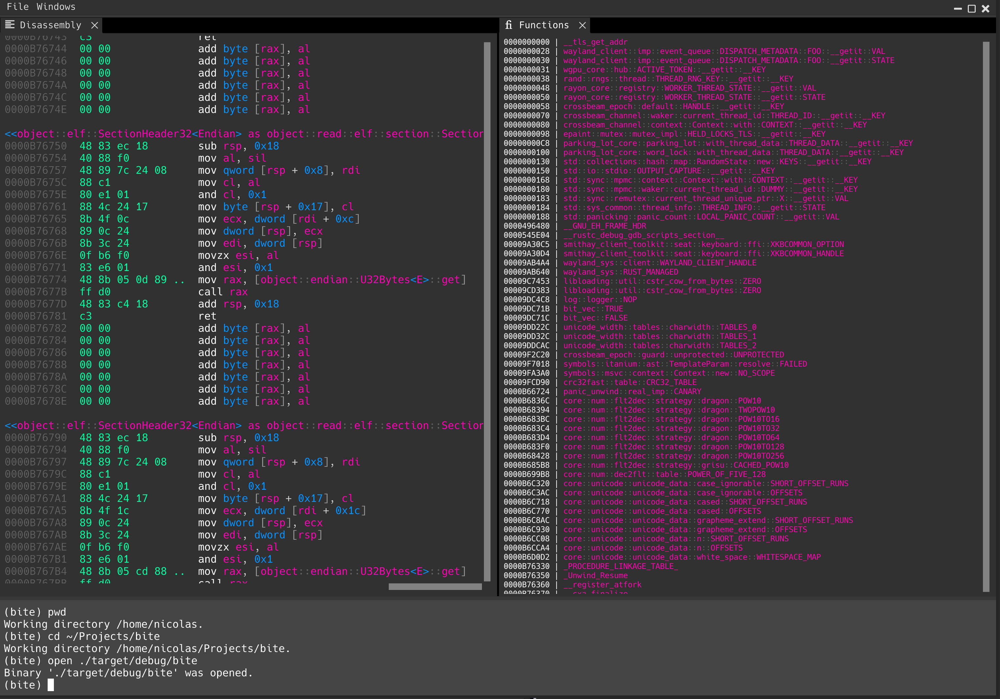
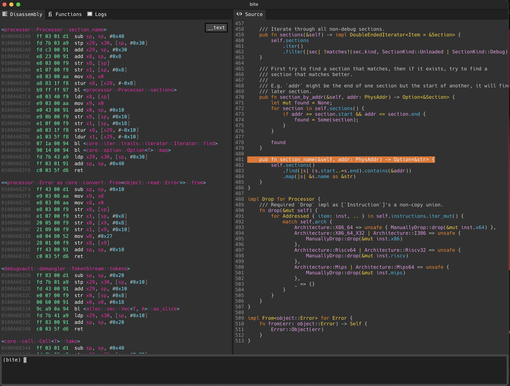

<h1 align="center">
  <picture>
    <source media="(prefers-color-scheme: dark)" srcset="./assets/logo_dark.png">
    
  </picture>
  <picture>
    <source media="(prefers-color-scheme: dark)" srcset="./assets/logo_text_dark.svg">
    
   </picture>
</h1>

<h4 align="center">Ever wanted to inspect every <i>bite</i> of your binary.</h4>

[](https://github.com/WINSDK/bite/actions/workflows/ci.yml)


`BiTE` is a platform-agnostic executable analysis tool. It aims to offer an
environment for inspecting the content of binaries and their debug info. While it is
still in early development, various architectures are supported.

## Showcase

Here is an example of the assembly listing viewing.



The ability to view a binary's disassembly and the associated source code.



## Installation

Building from source.
```
cargo install --path .
```

## Features yet to be implemented

Whenever I have time this year I'll try implementing most of these. \
If you feel like it, submit a pull request and I'll have a look at it!

- [x] Port GUI to wgpu + winit
- [x] Header with buttons and options
- [x] Assembly listing exploration
- [x] Interactive terminal
- [ ] Assembly instruction byte patching
- [x] Hex binary viewer
- [ ] Debugging front-end's
  - [ ] [GDB](https://www.sourceware.org/gdb)
  - [ ] [LLDB](https://lldb.llvm.org)
  - [ ] [WinDbg](https://windbg.org)
- [x] X86-64 support
- [x] AArch64/Armv7 support
- [x] Riscv64gc/Riscv32gc support
- [x] MIPS-V support
- [x] Demangling support for most targets
  - [x] MSVC
  - [x] Itanium
  - [x] Rust
- [x] Decoding datastructures depending on each section
- [ ] Assembly listing lifting
  - [x] Resolving addresses
  - [x] Interpreting non-code data
  - [ ] Creating labels for relative jumps
